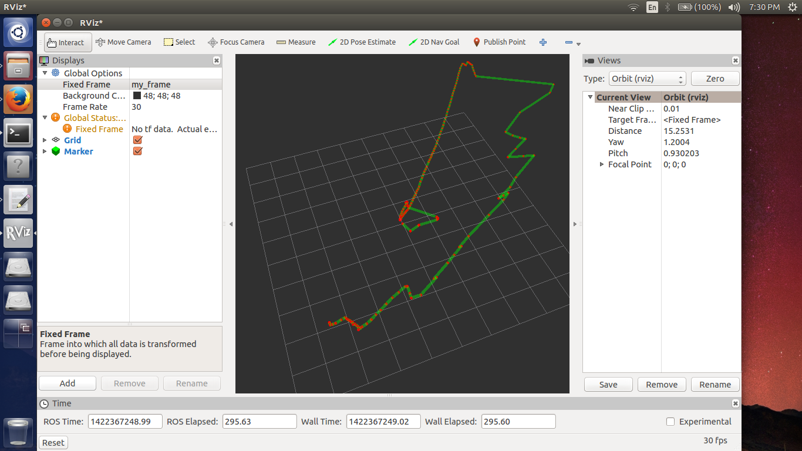

# Robotics at IIIT-Delhi (2015)

An archive of my robotics coursework at IIIT-Delhi, including a tunnel-following, obstacle-avoiding autonomous car and a ROS GPS/RViz assignment.

The autonomous car was an academic project from February–May 2015, developed by Manan Gakhar, Shreya Singh, and Prateekshit Pandey. I handled the software development, including the car’s navigation logic. The project used BeagleBone and multiple ultrasonic sensors; the preserved Python scripts implement distance measurement, motor GPIO control, and navigation decisions. The accompanying coursework used ROS 1 / ROS Indigo, C++, catkin, ROS topics, and RViz.

## Contents

- **`autonomous-car/`** — original `tunnel.py` and `tunnel1.py` development snapshots, using `Adafruit_BBIO.GPIO` and five ultrasonic-sensor positions.
- **`assignment1gps/`** — ROS package with a C++ publisher that reads GPGGA records from a GPS data file and a subscriber that publishes RViz markers.
- **`notes/`** — original ROS setup and command notes; filenames and text are preserved.
- **`docs/`** — an original RViz screenshot from the coursework.

## Archive status

The nine original files are preserved byte-for-byte; only their folder locations have changed. This is an incomplete historical snapshot, not a tested, runnable release. The Python files contain unfinished values, pin mappings, and code errors. The GPS publisher references a local path and a `GPS_data.txt` file that was not recovered. The supplied listener places markers along a line and does not reconstruct the trajectory shown in the screenshot. Building or running this archive would require restoration of the original environment, missing data, and implementation details.

The BeagleBone OS disk image is not included.

## Original RViz screenshot

— Manan Gakhar
